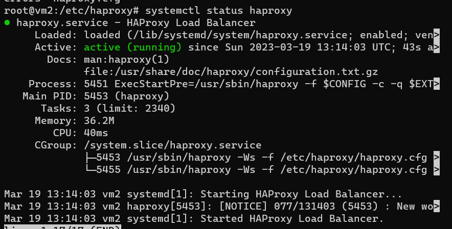
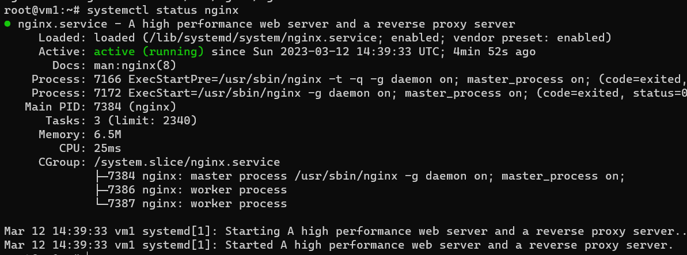
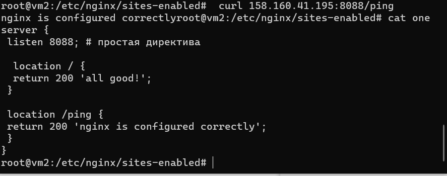

# Домашнее задание к занятию 10.5 «Балансировка нагрузки. HAProxy/Nginx»

### Задание 1

Что такое балансировка нагрузки и зачем она нужна? 

*Приведите ответ в свободной форме.*

Балансировка нагрузки (load balancing) — это процесс распределения нагрузки на пул серверов.

Балансировка нагрузки призвана оптимизировать использование ресурсов, максимально увеличить пропускную способность, минимизировать время отклика и избежать перегрузки отдельных ресурсов. Применение вместо одного компонента нескольких компонентов с балансировкой может повысить надёжность и доступность благодаря получившемуся запасу мощностей.

---

### Задание 2

Чем отличаются алгоритмы балансировки Round Robin и Weighted Round Robin? В каких случаях каждый из них лучше применять? 

*Приведите ответ в свободной форме.*

Weighted Round Robin распределяет нагрузку с учетом веса серверов в отличие от Round Robin, который предпологает, что все сервера имеют одинаковую мощность

---

### Задание 3

Установите и запустите Haproxy.

*Приведите скриншот systemctl status haproxy, где будет видно, что Haproxy запущен.*

curl https://haproxy.debian.net/bernat.debian.org.gpg | gpg --dearmor > /usr/share/keyrings/haproxy.debian.net.gpg

echo deb "[signed-by=/usr/share/keyrings/haproxy.debian.net.gpg]" http://haproxy.debian.net buster-backports-2.4 main > /etc/apt/sources.list.d/haproxy.list

---

### Задание 4

Установите и запустите Nginx.

*Приведите скриншот systemctl status nginx, где будет видно, что Nginx запущен.*

---

### Задание 5

Настройте Nginx на виртуальной машине таким образом, чтобы при запросе:

`curl http://localhost:8088/ping`

он возвращал в ответе строчку: 

"nginx is configured correctly".

*Приведите конфигурации настроенного Nginx сервиса и скриншот результата выполнения команды curl http://localhost:8088/ping.*

---

## Задания со звёздочкой*

Эти задания дополнительные. Их выполнять не обязательно. На зачёт это не повлияет. Вы можете их выполнить, если хотите глубже разобраться в материале.

---

### Задание 6*

Настройте Haproxy таким образом, чтобы при ответе на запрос:

`curl http://localhost:8080/`

он проксировал его в Nginx на порту 8088, который был настроен в задании 5 и возвращал от него ответ: 

"nginx is configured correctly". 

*Приведите конфигурации настроенного Haproxy и скриншоты результата выполнения команды curl http://localhost:8080/.*

