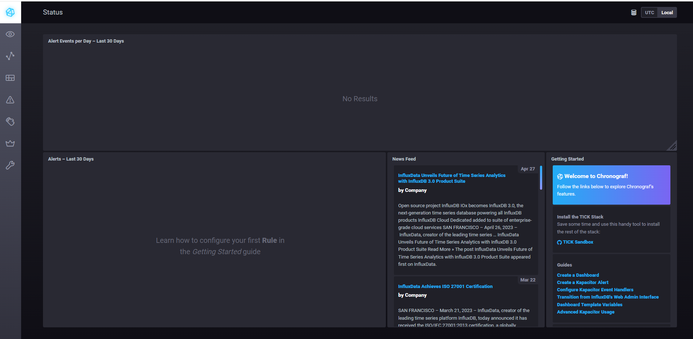
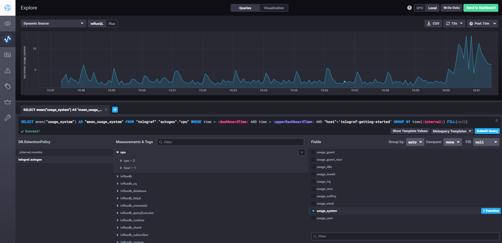
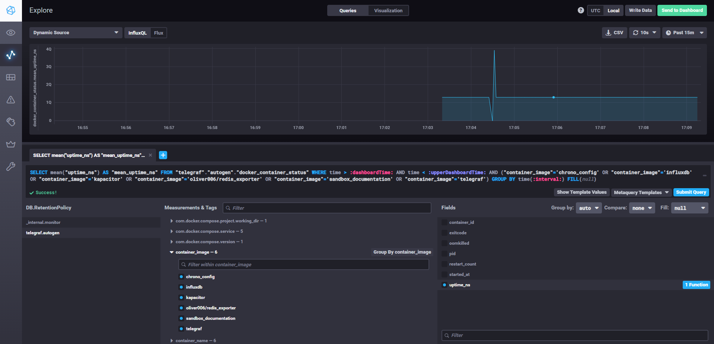

# Домашнее задание к занятию "13.Системы мониторинга"

## Обязательные задания

1. Вас пригласили настроить мониторинг на проект. На онбординге вам рассказали, что проект представляет из себя 
платформу для вычислений с выдачей текстовых отчетов, которые сохраняются на диск. Взаимодействие с платформой 
осуществляется по протоколу http. Также вам отметили, что вычисления загружают ЦПУ. Какой минимальный набор метрик вы
выведите в мониторинг и почему?

ответ:
Основные метрики для мониторинга:
1. CPU
2. RAM
3. disk
4. доступность сервиса, типо время отклика и кол-во ошибок

#
2. Менеджер продукта посмотрев на ваши метрики сказал, что ему непонятно что такое RAM/inodes/CPUla. Также он сказал, 
что хочет понимать, насколько мы выполняем свои обязанности перед клиентами и какое качество обслуживания. Что вы 
можете ему предложить?

Описание метрик для менеджера:
RAM - оперативная память. Может быть множество показателей работы оператвной памяти, такие как общее количество, доступное количество, скорость ее работы, коррекция ошибок. Размер оперативной памяти сервера влияет на скорость работы сервера, т.к. при большом объеме памяти сервер может выполнять больше задач и процессов одновременно.

inodes - структуры данных, которые хранят метаданных о файлах или каталогах в файловой системе диска. Каждый файл на диске содержит свой inode, который содержит информацию о размещении этого файла на диске, его временных метках, размере, правах доступа. Количество inodes в файловой системе ограничено, поэтому при создании большого количества маленьких файлов может возникнуть проблема исчерпания inodes. В данном проекте при создании множества файлов текстовых отчетов может быстро закончиться количество доступных inodes, при том, что место на диске все ещё может быть много. Для решения этой проблемы может потребоваться изменение настроек файловой системы диска.

CPUla - показатель того, на сколько интенсивно нагружен процессор. Значение средней загрузки процессора поможет определить, на сколько процессор справляется с работой. Но важно понимать, что каждый случай индивидуален и перед решением о замене процессора на более производительный нужно проанализировать, какие процессы и нагружают процессор и почему.

#
3. Вашей DevOps команде в этом году не выделили финансирование на построение системы сбора логов. Разработчики в свою 
очередь хотят видеть все ошибки, которые выдают их приложения. Какое решение вы можете предпринять в этой ситуации, 
чтобы разработчики получали ошибки приложения?

Использовать бесплатные системы сбора логов, типо elasticSearch

#
4. Вы, как опытный SRE, сделали мониторинг, куда вывели отображения выполнения SLA=99% по http кодам ответов. 
Вычисляете этот параметр по следующей формуле: summ_2xx_requests/summ_all_requests. Данный параметр не поднимается выше 
70%, но при этом в вашей системе нет кодов ответа 5xx и 4xx. Где у вас ошибка?

SLI = (summ_2xx_requests + summ_3xx_requests) / (summ_all_requests)
summ_3xx_requests - не учли

#
5. Опишите основные плюсы и минусы pull и push систем мониторинга.

Плюсы:

- Меньшая задержка времени: данные передаются в режиме реального времени, система мониторинга также отображает информацию почти в реальном времени. Это особенно важно для критически важных систем, где даже кратковременная задержка может иметь серьезные последствия.

- Большая гибкость настройки: в push-системах мониторинга можно гибко настроить, выбирать какие данные и как часто отправлять.

Минусы:

- Высокая нагрузка на сеть: поскольку данные активно на сервер мониторинга, то значительно вырастает нагрузка на сеть. Это может вызывать проблемы с пропускной способностью сети.
- Настройка push-систем мониторинга может вызвать сложности при ее настройке, т.к. нужно будет определиться с метриками, которые нужно передавать на сервер мониторинга.

Pull-системы мониторинга:

Плюсы:

- Меньшая нагрузка на сеть: в pull-системах мониторинга мониторинговая система запрашивает данные у мониторируемых систем только тогда, когда это необходимо. Это помогает снизить нагрузку на сеть.

- Единая точка контроля: при использовании pull-системы мониторинга весь процесс мониторинга и получение данных осуществляется на сервере мониторинга. Это упрощает управление и обеспечивает единую точку контроля.

Минусы:

- Задержка времени: в pull-системах мониторинга данные получаются только после того, как система мониторинга запросит их у мониторируемых устройств или приложений. Это может затруднить моментальную реакцию на проблемы и отсрочить их решение.

- Отказоустойчивость: если сервер мониторинга недоступен или некорректно настроен, данные могут быть недоступны или неполными.

#
6. Какие из ниже перечисленных систем относятся к push модели, а какие к pull? А может есть гибридные?

    - Prometheus 
    - TICK
    - Zabbix
    - VictoriaMetrics
    - Nagios

Prometheus - использует pull модель, получает данные с экспортеров, которые установлены на мониторируемые хосты
TICK - скорее всего push модель, т.к. Telegraf активно собирает метрики и отправляет их в InfluxDB.
Zabbix - использует гибридную модель, т.к. он принимает данные от своих агентов. Но при этом и отправляет запросы своим агентам, чтобы проверить их доступность либо доступность оборудования.
VictoriaMetrics - использует гибридную модель. Он может принимать данные с экспортеров или запрашивать данные из других систем мониторинга.
Nagios - использует гибридную модель, pull модель используется по умолчанию, но может быть настроен push режим работы.

#
7. Запустил TICK-стэк, скриншот Сhronograf:

#
8. Отобразил график утилизации CPU машины, на которой запущен TICK-стэк. В настройках графика включил отображение данных за последние 15 минут с интервалом обновления раз в 15 секунд:

#
9. Установил Docker Input Plugin для Telegraf, настроил его. Возникли проблемы с разрешением на доступ Telegraf к `/var/run/docker.sock`. После решения этой проблемы, удалось получить метрики от docker контейнеров:

