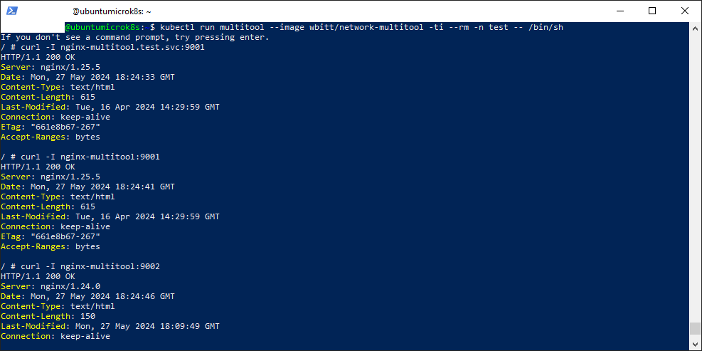
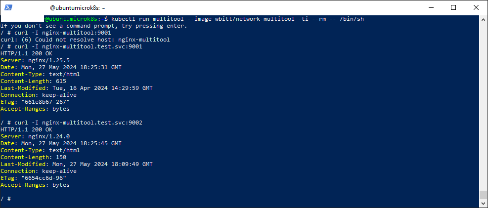
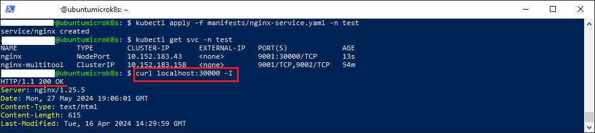

### Задание 1. Создать Deployment и обеспечить доступ к контейнерам приложения по разным портам из другого Pod внутри кластера

1. Создать Deployment приложения, состоящего из двух контейнеров (nginx и multitool), с количеством реплик 3 шт.
2. Создать Service, который обеспечит доступ внутри кластера до контейнеров приложения из п.1 по порту 9001 — nginx 80, по 9002 — multitool 8080.
3. Создать отдельный Pod с приложением multitool и убедиться с помощью `curl`, что из пода есть доступ до приложения из п.1 по разным портам в разные контейнеры.
4. Продемонстрировать доступ с помощью `curl` по доменному имени сервиса.
5. Предоставить манифесты Deployment и Service в решении, а также скриншоты или вывод команды п.4.

### Решение 1

1. Манифест deployment-а для двух контейнеров nginx и multitool находится в [файле](manifests/nginx-multitool.yaml)
2. Манифест сервиса с типом ClusterIP находится в [файле](manifests/nginx-multitool-service.yaml)
3. Создаем и запускаем тестовый под с образом multitool, который автоматически удалится по завершении(флаг --rm):
  ```kubectl run multitool --image wbitt/network-multitool -ti --rm -- /bin/sh```
4. Проверяем доступность приложений изнутри кластера командами внутри namespace *test*:
  > curl nginx-multitool:9001 \
  > curl nginx-multitool:9002

  

5. Проверяем доступность приложений изнутри кластера командами снаружи namespace *test*:
  > curl nginx-multitool.test.svc:9001 \
  > curl nginx-multitool.test.svc:9002



------

### Задание 2. Создать Service и обеспечить доступ к приложениям снаружи кластера

1. Создать отдельный Service приложения из Задания 1 с возможностью доступа снаружи кластера к nginx, используя тип NodePort.
2. Продемонстрировать доступ с помощью браузера или `curl` с локального компьютера.
3. Предоставить манифест и Service в решении, а также скриншоты или вывод команды п.2.

### Решение 2

1. Манифест сервиса с типом NodePort, который делает доступным nginx снаружи кластера, доступен в [файле](manifests/nginx-service.yaml)
2. Для проверки доступности nginx используем команду:
   ``` curl localhost:30000 -I ```
   Результат выполнения команды приведен на скриншоте ниже:
    