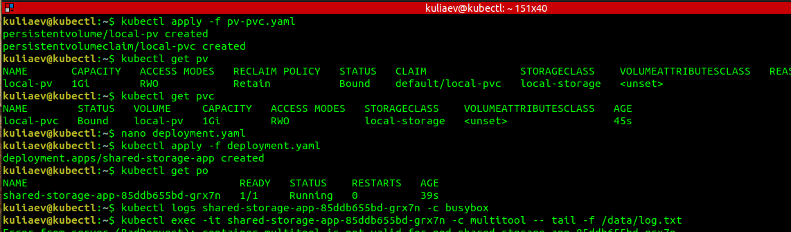

# Домашнее задание к занятию «Хранение в K8s. Часть 2»    Mikhail Kuliaev

### Цель задания

В тестовой среде Kubernetes нужно создать PV и продемострировать запись и хранение файлов.

------

### Чеклист готовности к домашнему заданию

1. Установленное K8s-решение (например, MicroK8S).
2. Установленный локальный kubectl.
3. Редактор YAML-файлов с подключенным GitHub-репозиторием.

------

### Дополнительные материалы для выполнения задания

1. [Инструкция по установке NFS в MicroK8S](https://microk8s.io/docs/nfs). 
2. [Описание Persistent Volumes](https://kubernetes.io/docs/concepts/storage/persistent-volumes/). 
3. [Описание динамического провижининга](https://kubernetes.io/docs/concepts/storage/dynamic-provisioning/). 
4. [Описание Multitool](https://github.com/wbitt/Network-MultiTool).

------

### Задание 1

**Что нужно сделать**

Создать Deployment приложения, использующего локальный PV, созданный вручную.

1. Создать Deployment приложения, состоящего из контейнеров busybox и multitool.
2. Создать PV и PVC для подключения папки на локальной ноде, которая будет использована в поде.
3. Продемонстрировать, что multitool может читать файл, в который busybox пишет каждые пять секунд в общей директории. 
4. Удалить Deployment и PVC. Продемонстрировать, что после этого произошло с PV. Пояснить, почему.
5. Продемонстрировать, что файл сохранился на локальном диске ноды. Удалить PV.  Продемонстрировать что произошло с файлом после удаления PV. Пояснить, почему.
5. Предоставить манифесты, а также скриншоты или вывод необходимых команд.

------
pv-pvc.yaml

```yml
apiVersion: v1
kind: PersistentVolume
metadata:
  name: local-pv
spec:
  capacity:
    storage: 1Gi
  volumeMode: Filesystem
  accessModes:
    - ReadWriteOnce
  persistentVolumeReclaimPolicy: Retain
  storageClassName: local-storage
  local:
    path: /mnt/data 
  nodeAffinity:
    required:
      nodeSelectorTerms:
      - matchExpressions:
        - key: kubernetes.io/hostname
          operator: In
          values:
          - microk8s
---
apiVersion: v1
kind: PersistentVolumeClaim
metadata:
  name: local-pvc
spec:
  accessModes:
    - ReadWriteOnce
  storageClassName: local-storage
  resources:
    requests:
      storage: 1Gi


```
deployment.yaml

```yml
apiVersion: apps/v1
kind: Deployment
metadata:
  name: shared-storage-app
spec:
  replicas: 1
  selector:
    matchLabels:
      app: shared-storage
  template:
    metadata:
      labels:
        app: shared-storage
    spec:
      containers:
      - name: busybox
        image: busybox:latest
        command: ["/bin/sh", "-c"]
        args:
          - >
            while true; do
              echo "$(date) - Hi log hi" >> /data/log.txt;
              sleep 5;
            done
        volumeMounts:
        - name: shared-volume
          mountPath: /data
      volumes:
      - name: shared-volume
        persistentVolumeClaim:
          claimName: local-pvc


```




### Задание 2

**Что нужно сделать**

Создать Deployment приложения, которое может хранить файлы на NFS с динамическим созданием PV.

1. Включить и настроить NFS-сервер на MicroK8S.
2. Создать Deployment приложения состоящего из multitool, и подключить к нему PV, созданный автоматически на сервере NFS.
3. Продемонстрировать возможность чтения и записи файла изнутри пода. 
4. Предоставить манифесты, а также скриншоты или вывод необходимых команд.

------
nfs-pvc.yaml

```yml
apiVersion: v1
kind: PersistentVolumeClaim
metadata:
  name: nfs-pvc
spec:
  accessModes:
    - ReadWriteOnce
  resources:
    requests:
      storage: 1Gi

```
nfs-deployment.yaml

```yml
apiVersion: apps/v1
kind: Deployment
metadata:
  name: nfs-app
spec:
  replicas: 1
  selector:
    matchLabels:
      app: nfs-app
  template:
    metadata:
      labels:
        app: nfs-app
    spec:
      containers:
      - name: multitool
        image: wbitt/network-multitool:latest
        command: ["/bin/sh", "-c"]
        args:
          - >
            while true; do
              echo "$(date) - NFS test" >> /data/nfs-test.txt;
              sleep 5;
            done
        volumeMounts:
        - name: nfs-volume
          mountPath: /data
      volumes:
      - name: nfs-volume
        persistentVolumeClaim:
          claimName: nfs-pvc

```


### Правила приёма работы

1. Домашняя работа оформляется в своём Git-репозитории в файле README.md. Выполненное задание пришлите ссылкой на .md-файл в вашем репозитории.
2. Файл README.md должен содержать скриншоты вывода необходимых команд `kubectl`, а также скриншоты результатов.
3. Репозиторий должен содержать тексты манифестов или ссылки на них в файле README.md.
