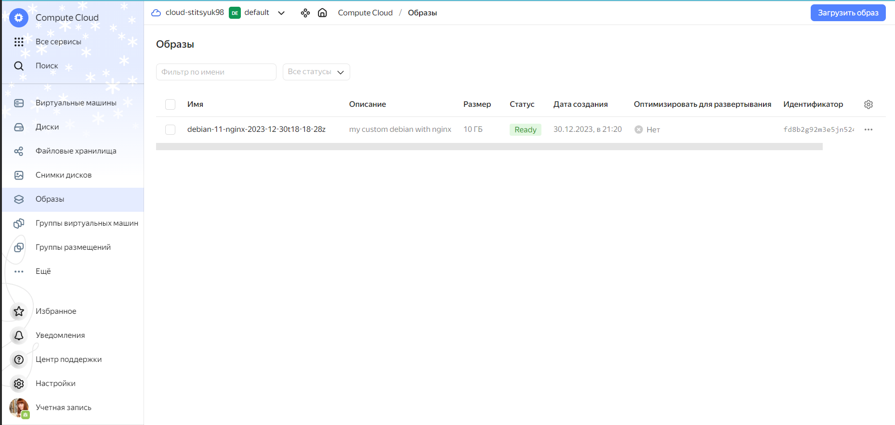
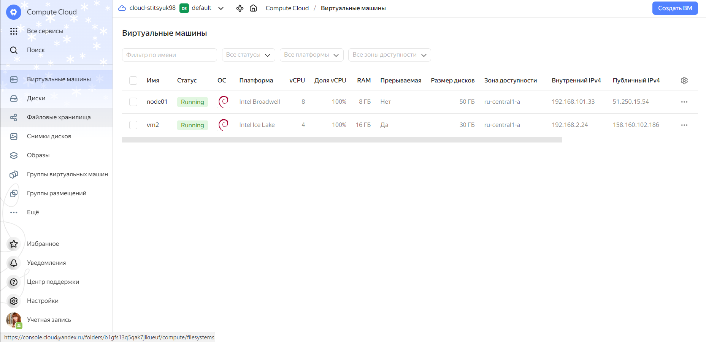
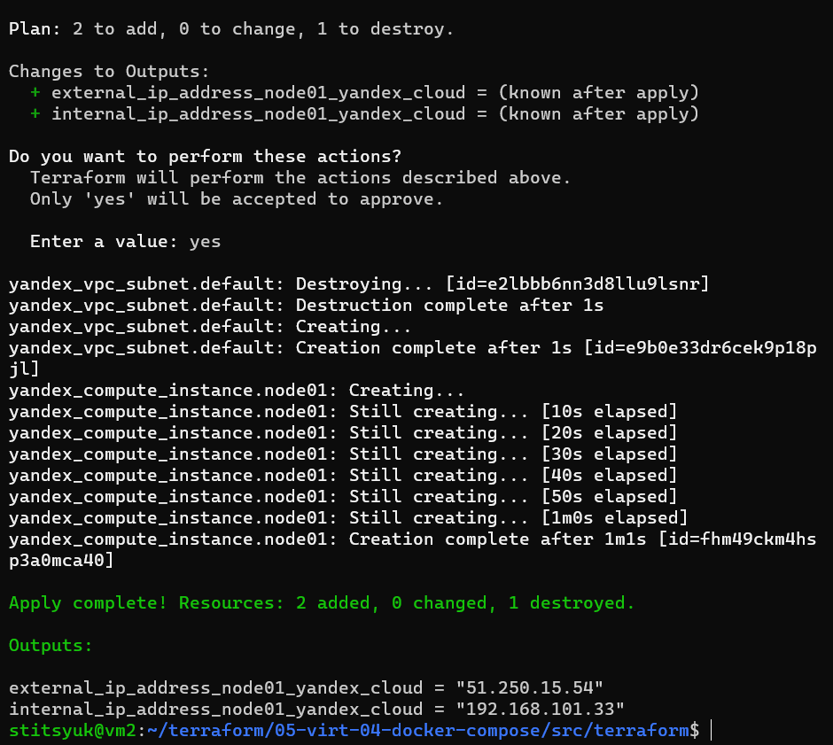
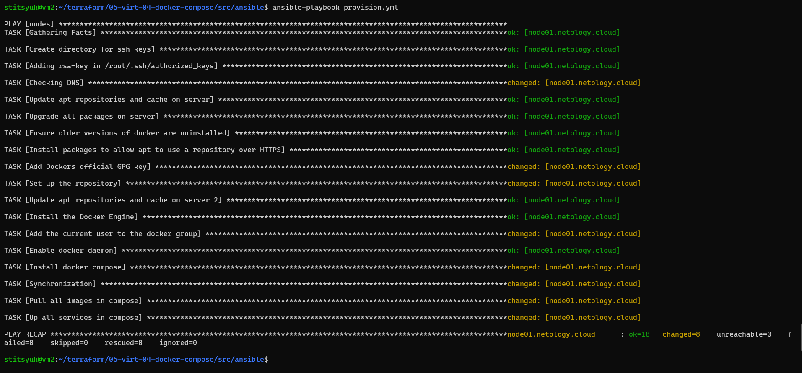
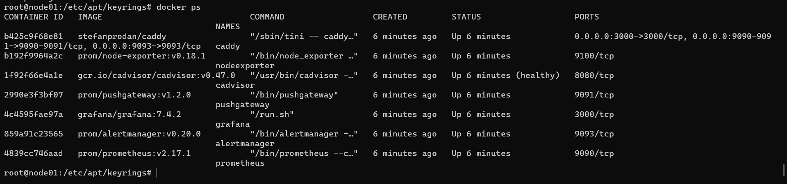
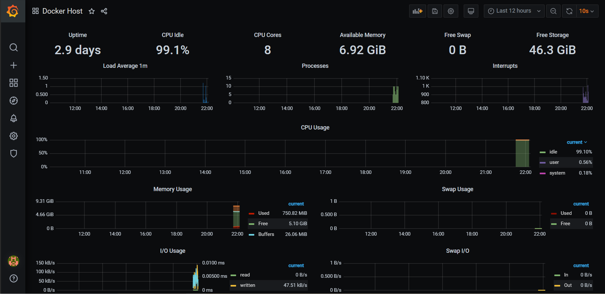
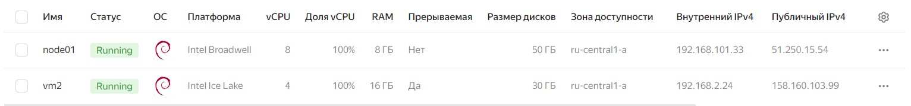

# Домашнее задание к занятию "4. Оркестрация группой Docker контейнеров на примере Docker Compose"

---

## Задача 1

Создать собственный образ  любой операционной системы (например, ubuntu-20.04) с помощью Packer ([инструкция](https://cloud.yandex.ru/docs/tutorials/infrastructure-management/packer-quickstart))

Для получения зачета вам необходимо предоставить скриншот страницы с созданным образом из личного кабинета YandexCloud.

## Задача 2

Создать вашу первую виртуальную машину в YandexCloud с помощью terraform. 
Используйте terraform код в директории ([src/terraform](https://github.com/netology-group/virt-homeworks/tree/virt-11/05-virt-04-docker-compose/src/terraform))

Для получения зачета, вам необходимо предоставить вывод команды terraform apply и страницы свойств созданной ВМ из личного кабинета YandexCloud.

token: y0_AgAAAAAOvnKDAATuwQAAAADaBnbgCAKEYzmRSVChRKqmgjdaBr307NQ
cloud-id: b1gri9i35rd1ghpm0kjd
folder-id: b1gfs13q5qak7jlkueuf
compute-default-zone: ru-central1-b
yc compute image list -   fd8b2g92m3e5jn5243sk

export PATH=$PATH:/lib/terraform
https://habr.com/ru/companies/otus/articles/696694/

## Задача 3

С помощью ansible+docker-compose разверните на виртуальной машине из предыдущего задания систему мониторинга на основе Prometheus/Grafana .
Используйте ansible код в директории ([src/ansible](https://github.com/netology-group/virt-homeworks/tree/virt-11/05-virt-04-docker-compose/src/ansible))

Для получения зачета вам необходимо предоставить вывод команды "docker ps" , все контейнеры, описанные в ([docker-compose](https://github.com/netology-group/virt-homeworks/blob/virt-11/05-virt-04-docker-compose/src/ansible/stack/docker-compose.yaml)),  должны быть в статусе "Up".

https://internet-lab.ru/ansible_cfg_777

https://github.com/docker/docs/issues/15727

## Задача 4
Откройте web браузер, зайдите на страницу http://<внешний_ip_адрес_вашей_ВМ>:3000.
Используйте для авторизации логин и пароль из ([.env-file](https://github.com/netology-group/virt-homeworks/blob/virt-11/05-virt-04-docker-compose/src/ansible/stack/.env)).
Изучите доступный интерфейс, найдите в интерфейсе автоматически созданные docker-compose панели с графиками([dashboards](https://grafana.com/docs/grafana/latest/dashboards/use-dashboards/)).
Подождите 5-10 минут, чтобы система мониторинга успела накопить данные.

Для получения зачета, вам необходимо предоставить: 
- Скриншот работающего веб-интерфейса Grafana с текущими метриками, как на примере ниже

## Задача 5 (*)

Создать вторую ВМ и подключить её к мониторингу развёрнутому на первом сервере.

Для получения зачета, вам необходимо предоставить:
- Скриншот из Grafana, на котором будут отображаться метрики добавленного вами сервера.
