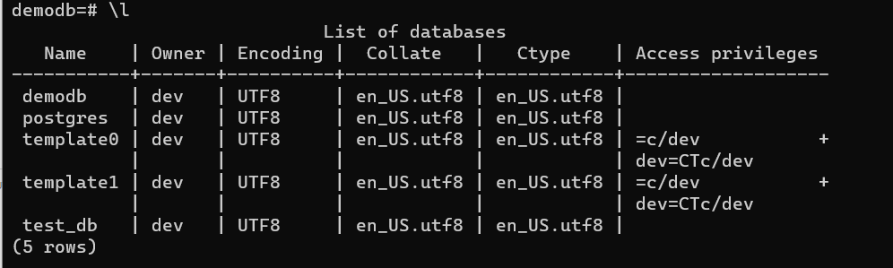
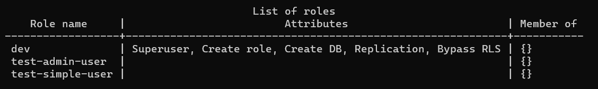
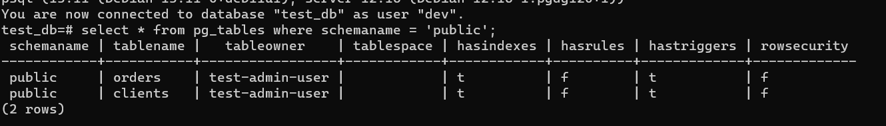
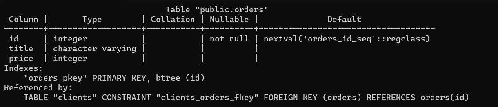
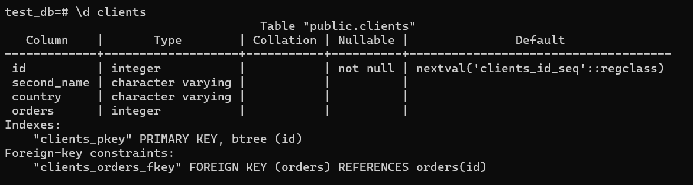
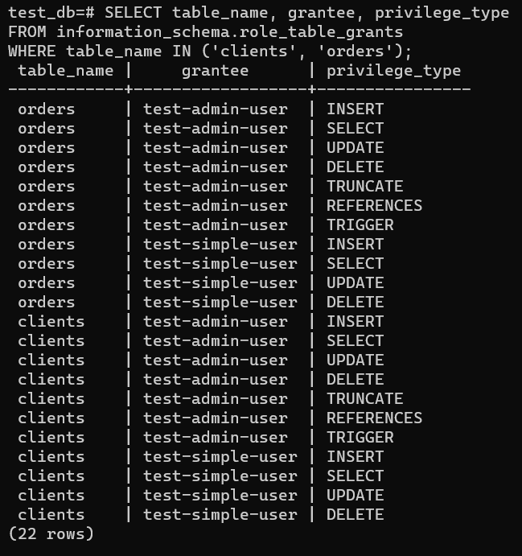
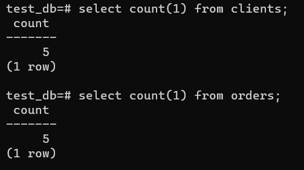
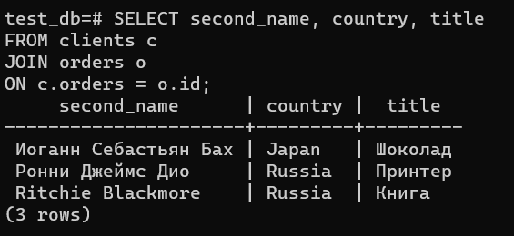
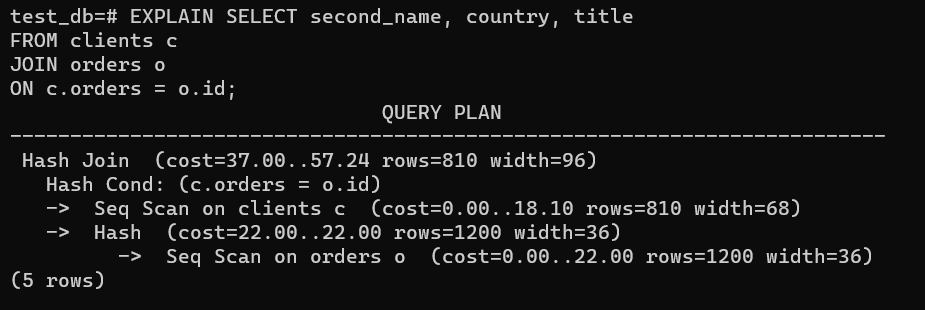
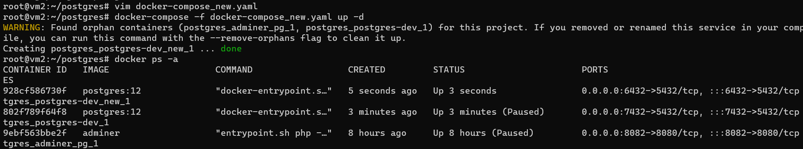

# Домашнее задание к занятию 2. «SQL»

## Задача 1

Используя Docker, поднимите инстанс PostgreSQL (версию 12) c 2 volume, 
в который будут складываться данные БД и бэкапы.

Приведите получившуюся команду или docker-compose-манифест.

```
version: '3'

services:

  postgres-dev:
    image: postgres:12
    environment:
      POSTGRES_USER: dev
      POSTGRES_PASSWORD: password
      POSTGRES_DB: demodb
    ports:
      - 6432:5432
    volumes:
      - ~/postgres-data:/var/lib/postgresql/data
      - ~/backup:/media/postgresql/backup
```

## Задача 2

В БД из задачи 1: 

- создайте пользователя test-admin-user и БД test_db;
- в БД test_db создайте таблицу orders и clients (спeцификация таблиц ниже);
- предоставьте привилегии на все операции пользователю test-admin-user на таблицы БД test_db;

`GRANT ALL PRIVILEGES ON ALL TABLES IN SCHEMA public TO "test-admin-user"`

- создайте пользователя test-simple-user;

`CREATE USER "test-simple-user" WITH PASSWORD 'admin';`

- предоставьте пользователю test-simple-user права на SELECT/INSERT/UPDATE/DELETE этих таблиц БД test_db.

`GRANT SELECT, INSERT, UPDATE, DELETE ON ALL TABLES IN SCHEMA public TO "test-simple-user"`

Таблица orders:

- id (serial primary key);
- наименование (string);
- цена (integer).

```
CREATE TABLE orders (
 id serial primary key,
 title varchar,
 price integer
)
```

Таблица clients:

- id (serial primary key);
- фамилия (string);
- страна проживания (string, index);
- заказ (foreign key orders).

```
CREATE TABLE clients (
 id serial primary key,
 second_name varchar,
 country varchar,
 orders integer references orders(id)
)
```

Приведите:

- итоговый список БД после выполнения пунктов выше; 







- описание таблиц (describe);





- SQL-запрос для выдачи списка пользователей с правами над таблицами test_db;

```
SELECT table_name, grantee, privilege_type
FROM information_schema.role_table_grants
WHERE table_name IN ('clients', 'orders');
```

- список пользователей с правами над таблицами test_db.



## Задача 3

Используя SQL-синтаксис, наполните таблицы следующими тестовыми данными:

Таблица orders

|Наименование|цена|
|------------|----|
|Шоколад| 10 |
|Принтер| 3000 |
|Книга| 500 |
|Монитор| 7000|
|Гитара| 4000|

Таблица clients

|ФИО|Страна проживания|
|------------|----|
|Иванов Иван Иванович| USA |
|Петров Петр Петрович| Canada |
|Иоганн Себастьян Бах| Japan |
|Ронни Джеймс Дио| Russia|
|Ritchie Blackmore| Russia|

```
INSERT INTO clients(second_name, country) VALUES ('Иванов Иван Иванович', 'USA');
INSERT INTO clients (second_name, country) VALUES ('Петров Петр Петрович', 'Canada');
INSERT INTO clients (second_name, country) VALUES ('Иоганн Себастьян Бах', 'Japan');
INSERT INTO clients (second_name, country) VALUES ('Ронни Джеймс Дио', 'Russia');
INSERT INTO clients (second_name, country) VALUES ('Ritchie Blackmore', 'Russia');
```

Используя SQL-синтаксис:
- вычислите количество записей для каждой таблицы.

Приведите в ответе:

    - запросы,
    - результаты их выполнения.



## Задача 4

Часть пользователей из таблицы clients решили оформить заказы из таблицы orders.

Используя foreign keys, свяжите записи из таблиц, согласно таблице:

|ФИО|Заказ|
|------------|----|
|Иванов Иван Иванович| Книга |
|Петров Петр Петрович| Монитор |
|Иоганн Себастьян Бах| Гитара |

Приведите SQL-запросы для выполнения этих операций.

```
UPDATE clients SET order = 3 WHERE id = 1;
UPDATE clients SET order = 4 WHERE id = 2;
UPDATE clients SET order = 5 WHERE id = 3;
```

Приведите SQL-запрос для выдачи всех пользователей, которые совершили заказ, а также вывод этого запроса.

```
SELECT second_name, country, title
FROM clients c 
JOIN orders o 
ON c.orders = o.id;
```
 


Подсказка: используйте директиву `UPDATE`.

## Задача 5

Получите полную информацию по выполнению запроса выдачи всех пользователей из задачи 4 
(используя директиву EXPLAIN).

```
EXPLAIN SELECT second_name, country, title
FROM clients c 
JOIN orders o 
ON c.orders = o.id;
```



Приведите получившийся результат и объясните, что значат полученные значения.

Сначала будет полностью построчно прочитана таблица orders
Для неё будет создан хэш по полю id
После будет прочитана таблица clients,
Для каждой строки по полю заказ будет проверено, соответствует ли она чему-то в кеше orders
Если ничему не соответствует - строка будет пропущена
Если соответствует, то на основе этой строки и всех подходящих строках хеша СУБД сформирует вывод
При запуске просто explain, Postgres напишет только примерный план выполнения запроса и для каждой операции предположит:

сколько роцессорного времени уйдёт на поиск первой записи и сбор всей выборки: cost=первая_запись..вся_выборка
сколько примерно будет строк: rows
какой будет средняя длина строки в байтах: width
Postgres делает предположения на основе статистики, которую собирает периодический выполня analyze запросы на выборку данных из служебных таблиц.

Если запустить explain analyze, то запрос будет выполнен и к плану добавятся уже точные данные по времени и объёму данных.

explain verbose и explain analyze verbose то для каждой операции выборки будут написаны поля таблиц, которые в выборку попали.

## Задача 6

Создайте бэкап БД test_db и поместите его в volume, предназначенный для бэкапов (см. задачу 1).

`root@vm2:~/postgres# export PGPASSWORD=password && pg_dumpall -h 158.160.104.159 -p 6432 -U dev > dump.sql`

Остановите контейнер с PostgreSQL, но не удаляйте volumes.

`docker compose pause`

Поднимите новый пустой контейнер с PostgreSQL.

`docker-compose -f docker-compose_new.yaml up -d`

Восстановите БД test_db в новом контейнере.

`Почему то все необходимое подтянулось само, никаких команд не потребовалось`




Приведите список операций, который вы применяли для бэкапа данных и восстановления. 

---

### Как cдавать задание

Выполненное домашнее задание пришлите ссылкой на .md-файл в вашем репозитории.

---

