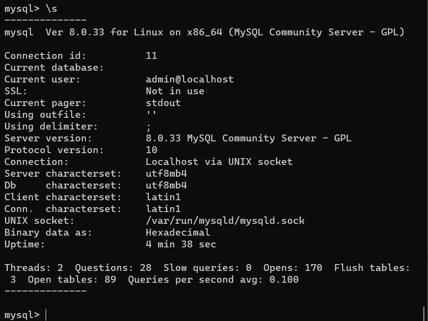
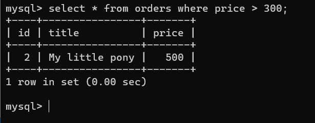
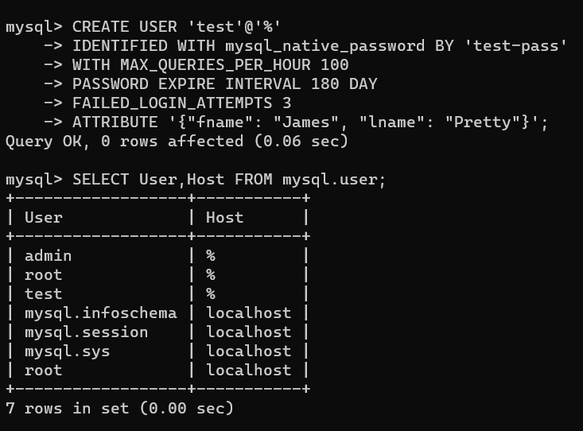
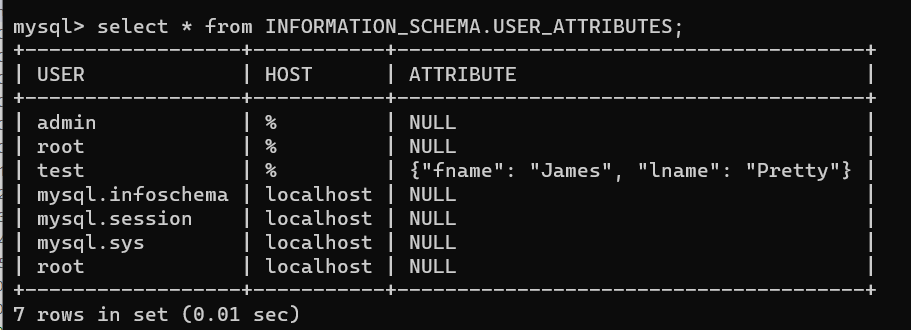
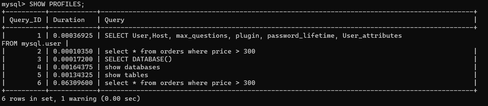
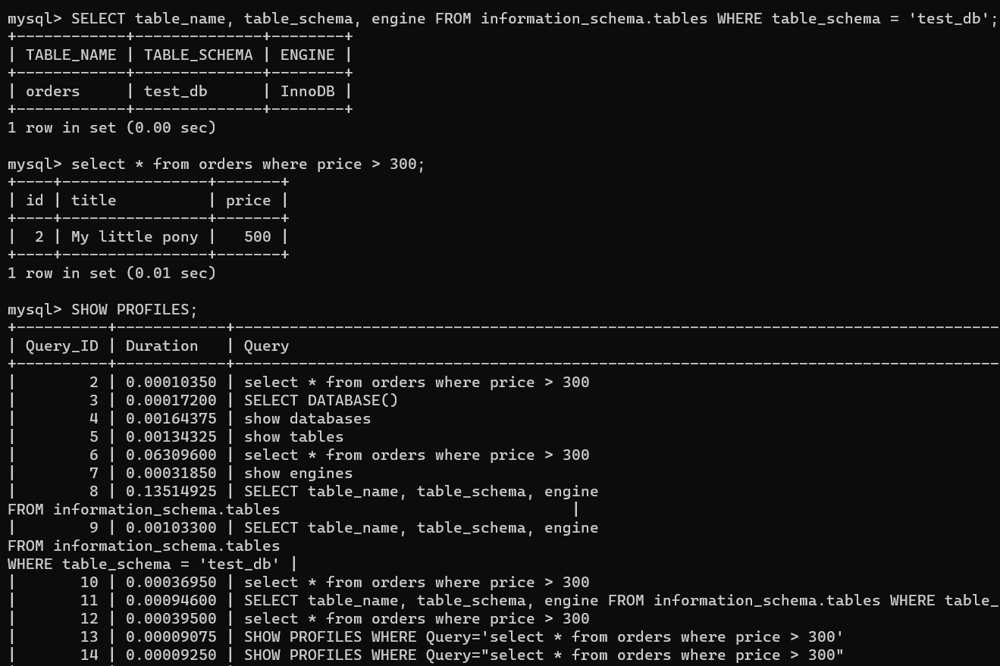
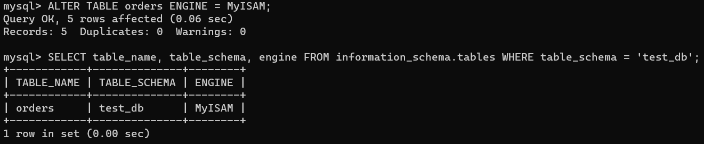
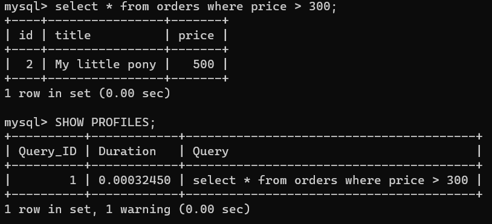

# Домашнее задание к занятию 3. «MySQL»

## Введение

Перед выполнением задания вы можете ознакомиться с 
[дополнительными материалами](https://github.com/netology-code/virt-homeworks/blob/virt-11/additional/README.md).

## Задача 1

Используя Docker, поднимите инстанс MySQL (версию 8). Данные БД сохраните в volume.

Изучите [бэкап БД](https://github.com/netology-code/virt-homeworks/tree/virt-11/06-db-03-mysql/test_data) и 
восстановитесь из него.

Перейдите в управляющую консоль `mysql` внутри контейнера.

Используя команду `\h`, получите список управляющих команд.

Найдите команду для выдачи статуса БД и **приведите в ответе** из её вывода версию сервера БД.

`Server version:         8.0.33 MySQL Community Server - GPL`



Подключитесь к восстановленной БД и получите список таблиц из этой БД.


**Приведите в ответе** количество записей с `price` > 300.



В следующих заданиях мы будем продолжать работу с этим контейнером.

## Задача 2

Создайте пользователя test в БД c паролем test-pass, используя:

- плагин авторизации mysql_native_password
- срок истечения пароля — 180 дней 
- количество попыток авторизации — 3 
- максимальное количество запросов в час — 100
- аттрибуты пользователя:
    - Фамилия "Pretty"
    - Имя "James".

```
CREATE USER 'test'@'%' 
IDENTIFIED WITH mysql_native_password BY 'test-pass'
WITH MAX_QUERIES_PER_HOUR 100
PASSWORD EXPIRE INTERVAL 180 DAY
FAILED_LOGIN_ATTEMPTS 3
ATTRIBUTE '{"fname": "James", "lname": "Pretty"}';

SELECT User,Host, max_questions, plugin, password_lifetime, User_attributes 
FROM mysql.user;
```




Предоставьте привелегии пользователю `test` на операции SELECT базы `test_db`.

```
GRANT SELECT ON test_db . * TO 'test'@'%';

FLUSH PRIVILEGES;

SHOW GRANTS FOR 'test'@'%';
```


    
Используя таблицу INFORMATION_SCHEMA.USER_ATTRIBUTES, получите данные по пользователю `test` и 
**приведите в ответе к задаче**.



## Задача 3

Установите профилирование `SET profiling = 1`.
Изучите вывод профилирования команд `SHOW PROFILES;`.



Исследуйте, какой `engine` используется в таблице БД `test_db` и **приведите в ответе**.

```
SELECT table_name, table_schema, engine
FROM information_schema.tables
WHERE table_schema = 'test_db';
```

Измените `engine` и **приведите время выполнения и запрос на изменения из профайлера в ответе**:
- на `MyISAM`,
- на `InnoDB`.

```
SELECT * FROM orders WHERE price > 300;

SHOW PROFILES WHERE Query='select * from orders where price > 300';
```







## Задача 4 

Изучите файл `my.cnf` в директории /etc/mysql.

Измените его согласно ТЗ (движок InnoDB):

- скорость IO важнее сохранности данных;
- нужна компрессия таблиц для экономии места на диске;
- размер буффера с незакомиченными транзакциями 1 Мб;
- буффер кеширования 30% от ОЗУ;
- размер файла логов операций 100 Мб.

Приведите в ответе изменённый файл `my.cnf`.

```
[mysqld]
pid-file        = /var/run/mysqld/mysqld.pid
socket          = /var/run/mysqld/mysqld.sock
datadir         = /var/lib/mysql
secure-file-priv= NULL

# Custom config should go here
!includedir /etc/mysql/conf.d/

# Netology
# Размер буфера кеширования 30% от размера оперативки в 8 Гб, кратный innodb_buffer_pool_chunk_size=128M
innodb_buffer_pool_size = 2560M
# Размер файла лога операций (общий размер логов равен innodb_log_file_size*2)
innodb_log_file_size = 100M
# Размер буфера для незакоммиченных транзакций
innodb_log_buffer_size = 1M
# Таблицы хранятся в отдельных файлах для компрессии таблиц
innodb_file_per_table = 1
innodb_file_format = Barracuda
# Производительность I/O операций (по умолчанию 200)
innodb_io_capacity = 1000
innodb_flush_log_at_trx_commit = 2
```