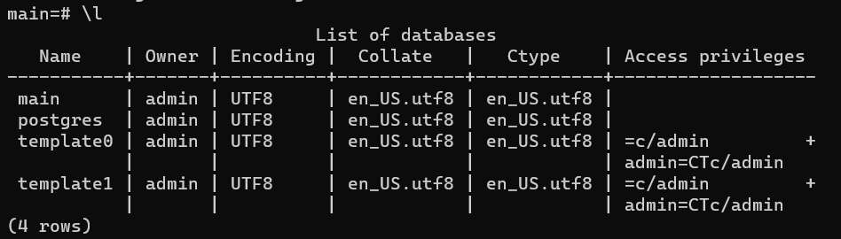
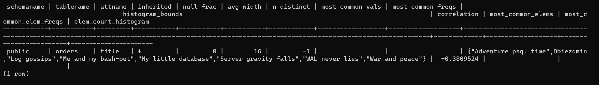

# Домашнее задание к занятию 4. «PostgreSQL»

## Задача 1

Используя Docker, поднимите инстанс PostgreSQL (версию 13). Данные БД сохраните в volume.

Подключитесь к БД PostgreSQL, используя `psql`.

Воспользуйтесь командой `\?` для вывода подсказки по имеющимся в `psql` управляющим командам.

**Найдите и приведите** управляющие команды для:

- вывода списка БД, - **\l**



- подключения к БД, - **\c database**
- вывода списка таблиц, - **\dt**
- вывода описания содержимого таблиц, - **\d tablename**
- выхода из psql. - **\q**

## Задача 2

Используя `psql`, создайте БД `test_database`.

`create database test_database;`

Изучите [бэкап БД](https://github.com/netology-code/virt-homeworks/tree/virt-11/06-db-04-postgresql/test_data).

Восстановите бэкап БД в `test_database`.

`psql -p 6432 -U admin -h 84.201.135.178 -W test_database < test_dump.sql`

Перейдите в управляющую консоль `psql` внутри контейнера.

Подключитесь к восстановленной БД и проведите операцию ANALYZE для сбора статистики по таблице.

Используя таблицу [pg_stats](https://postgrespro.ru/docs/postgresql/12/view-pg-stats), найдите столбец таблицы `orders` 
с наибольшим средним значением размера элементов в байтах.

```
select * from pg_catalog.pg_stats 
where tablename='orders' and 
   avg_width=(select max(avg_width) from pg_catalog.pg_stats where tablename='orders');
```



**Приведите в ответе** команду, которую вы использовали для вычисления, и полученный результат.

## Задача 3

Архитектор и администратор БД выяснили, что ваша таблица orders разрослась до невиданных размеров и
поиск по ней занимает долгое время. Вам как успешному выпускнику курсов DevOps в Нетологии предложили
провести разбиение таблицы на 2: шардировать на orders_1 - price>499 и orders_2 - price<=499.

Предложите SQL-транзакцию для проведения этой операции.

Можно ли было изначально исключить ручное разбиение при проектировании таблицы orders?

test_database=# CREATE TABLE orders_more_499_price (CHECK (price > 499)) INHERITS (orders);
CREATE TABLE
test_database=# INSERT INTO orders_more_499_price SELECT * FROM orders WHERE price > 499;
INSERT 0 3
test_database=# CREATE TABLE orders_less_499_price (CHECK (price <= 499)) INHERITS (orders);
CREATE TABLE
test_database=# INSERT INTO orders_LESS_499_price SELECT * FROM orders WHERE price <= 499;
INSERT 0 5
test_database=# DELETE FROM ONLY orders;
DELETE 8
test_database=# \dt
                 List of relations
 Schema |         Name          | Type  |  Owner   
--------+-----------------------+-------+----------
 public | orders                | table | postgres
 public | orders_less_499_price | table | postgres
 public | orders_more_499_price | table | postgres
(3 rows)

__________
При изначальном проектировании таблиц можно было сделать ее секционированной, 
тогда не пришлось бы переименовывать исходную таблицу и переносить данные в новую.

## Задача 4

Используя утилиту `pg_dump`, создайте бекап БД `test_database`.

Как бы вы доработали бэкап-файл, чтобы добавить уникальность значения столбца `title` для таблиц `test_database`?

`pg_dump -U admin test_database > my_dump.sql`

Для уникальности можно добавить индекс или первичный ключ.
    CREATE INDEX ON orders ((lower(title)));
--

