# Домашнее задание к занятию «Jenkins»

## Подготовка к выполнению

1. Создать два VM: для jenkins-master и jenkins-agent.
2. Установить Jenkins при помощи playbook.
3. Запустить и проверить работоспособность.
4. Сделать первоначальную настройку.

## Подготовка к выполнению

1. Создал две VM с помощью Terraform.

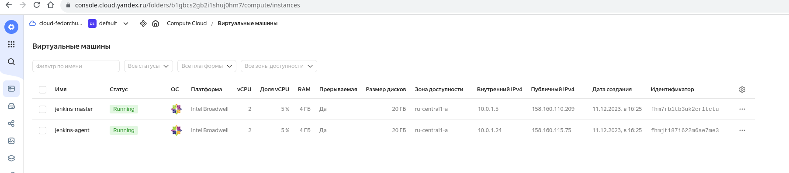

2. Установил Jenkins при помощи playbook.

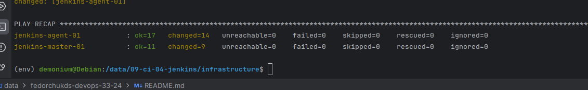

3. Запустил Jenkins и проверил его работоспособность.

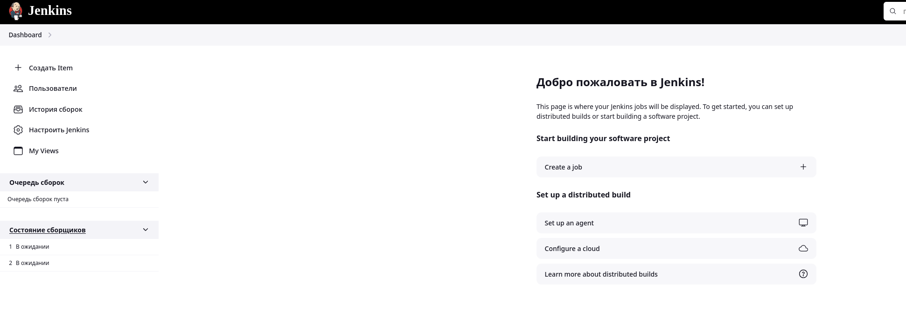

4. Сделал первоначальную настройку. Подключил агента используя JNLP, т.к. подключить по SSH не удалось.

Подключенный агент:

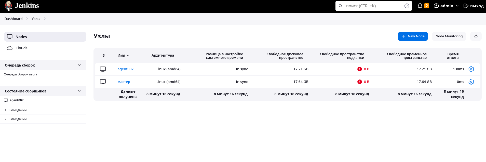

## Основная часть

1. Сделать Freestyle Job, который будет запускать `molecule test` из любого вашего репозитория с ролью.
2. Сделать Declarative Pipeline Job, который будет запускать `molecule test` из любого вашего репозитория с ролью.
3. Перенести Declarative Pipeline в репозиторий в файл `Jenkinsfile`.
4. Создать Multibranch Pipeline на запуск `Jenkinsfile` из репозитория.
5. Создать Scripted Pipeline, наполнить его скриптом из [pipeline](./pipeline).
6. Внести необходимые изменения, чтобы Pipeline запускал `ansible-playbook` без флагов `--check --diff`, если не установлен параметр при запуске джобы (prod_run = True). По умолчанию параметр имеет значение False и запускает прогон с флагами `--check --diff`.
7. Проверить работоспособность, исправить ошибки, исправленный Pipeline вложить в репозиторий в файл `ScriptedJenkinsfile`.
8. Отправить ссылку на репозиторий с ролью и Declarative Pipeline и Scripted Pipeline.
9. Сопроводите процесс настройки скриншотами для каждого пункта задания!!

## Решение основной части

1. Создал Freestyle Job, который запускает `molecule test` из моего [репозитория](https://github.com/DemoniumBlack/vector-role-molecule) с ролью vector-role:

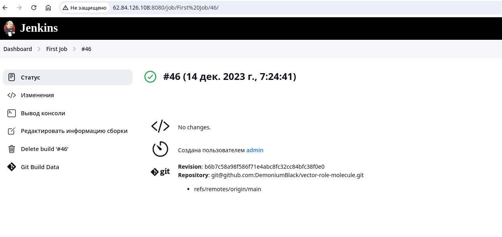

В настройках сборки указан этот репозиторий:

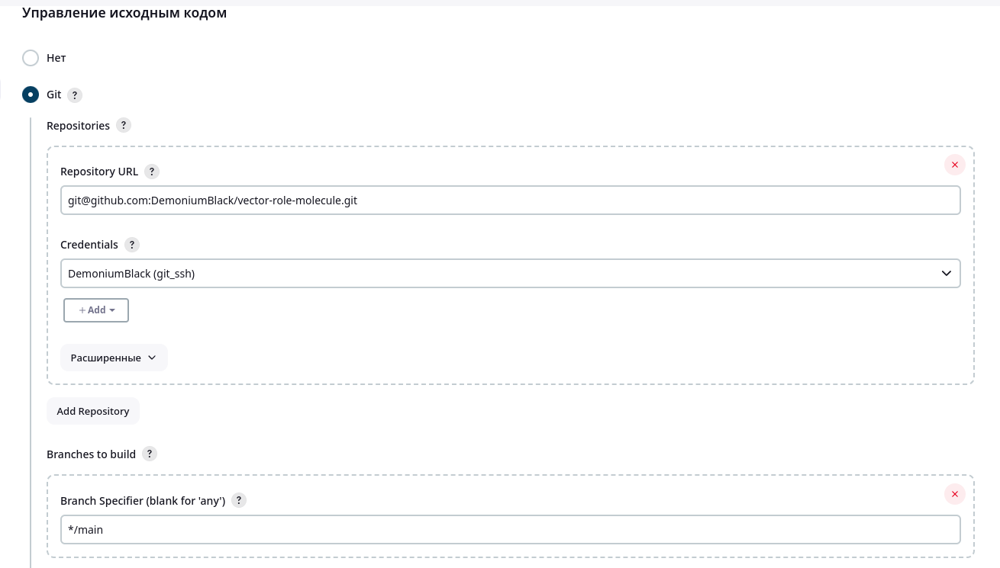

Во время сборки выполняются следующий команды:

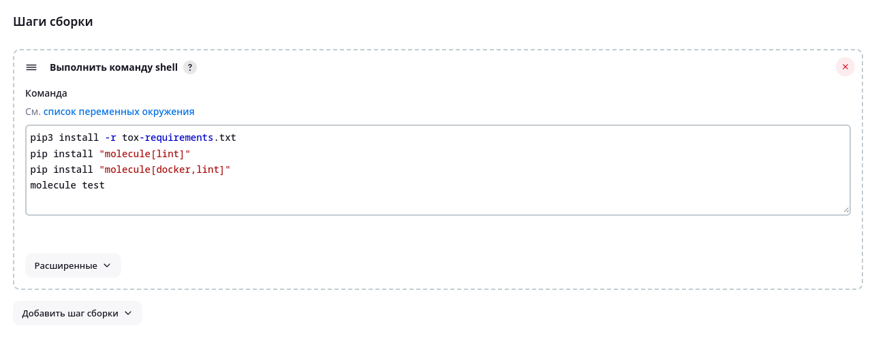

Сборка завершается успешно:

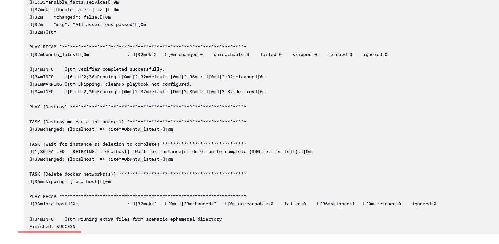

2. Создал Declarative Pipeline Job, который запускает `molecule test` из того же репозитория:

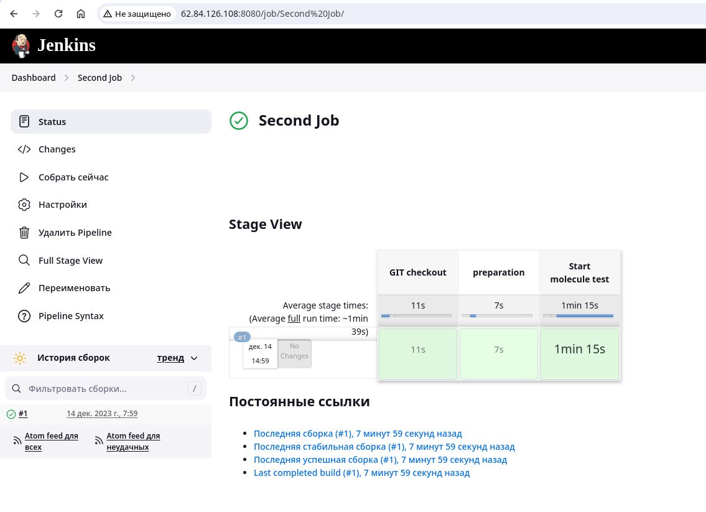

Выполняется следующий код:

```text
pipeline {
    agent any

    stages {
        stage('GIT checkout') {
            steps {
                echo 'Get from GIT repository'
                git credentialsId: 'git_ssh', 
                url: 'git@github.com:DemoniumBlack/vector-role-molecule.git',
                branch: 'main'
            }
        }
        stage('preparation') {
            steps {
                echo 'Start preparation'
                sh 'pip3 install -r tox-requirements.txt'
                sh 'pip install "molecule[lint]"'
                sh 'pip install "molecule[docker,lint]"'
            }
        }
        stage('Start molecule test') {
            steps {
                echo 'Run molecule test'
                sh 'molecule test'
            }
        }
    }
}
```

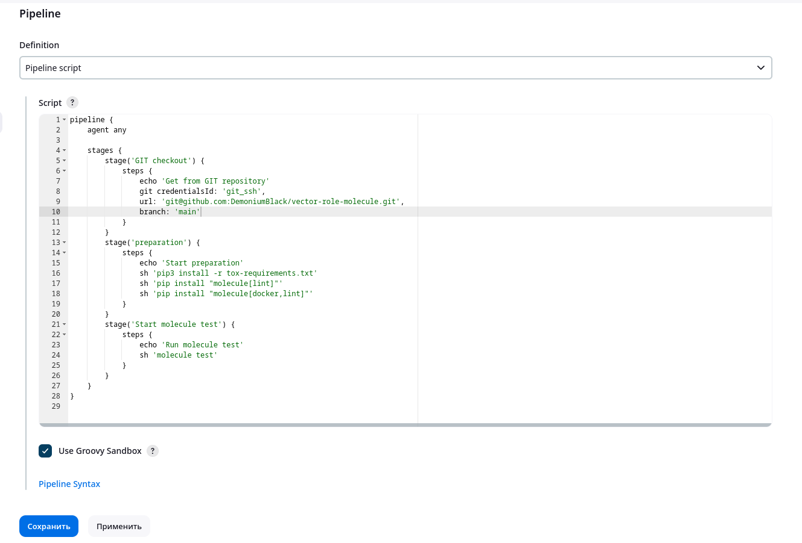

Сборка завершилась успешно:

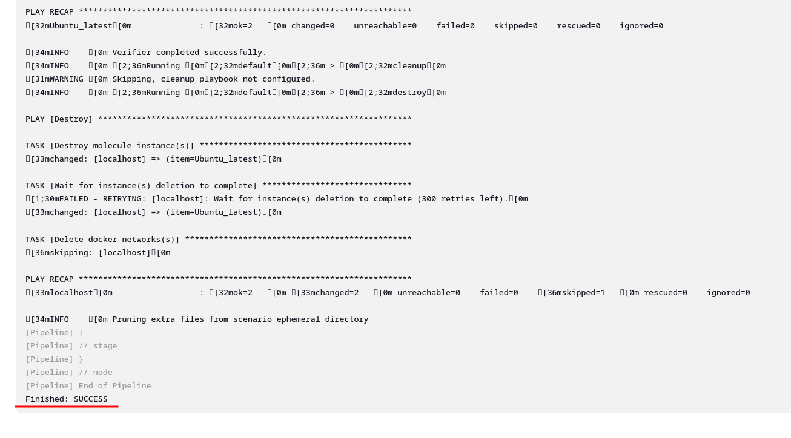

3. Перенес Declarative Pipeline в файл [Jenkinsfile](https://github.com/DemoniumBlack/vector-role-molecule/blob/main/Jenkinsfile).

4. Создал Multibranch Pipeline на запуск `Jenkinsfile` из репозитория.

Сначала выполняется сканирование удаленного репозитория для поиска веток, обнаружения Jenkinsfile, проверки изменения репозитория или изменения Jenkinsfile. Результат сканирования:

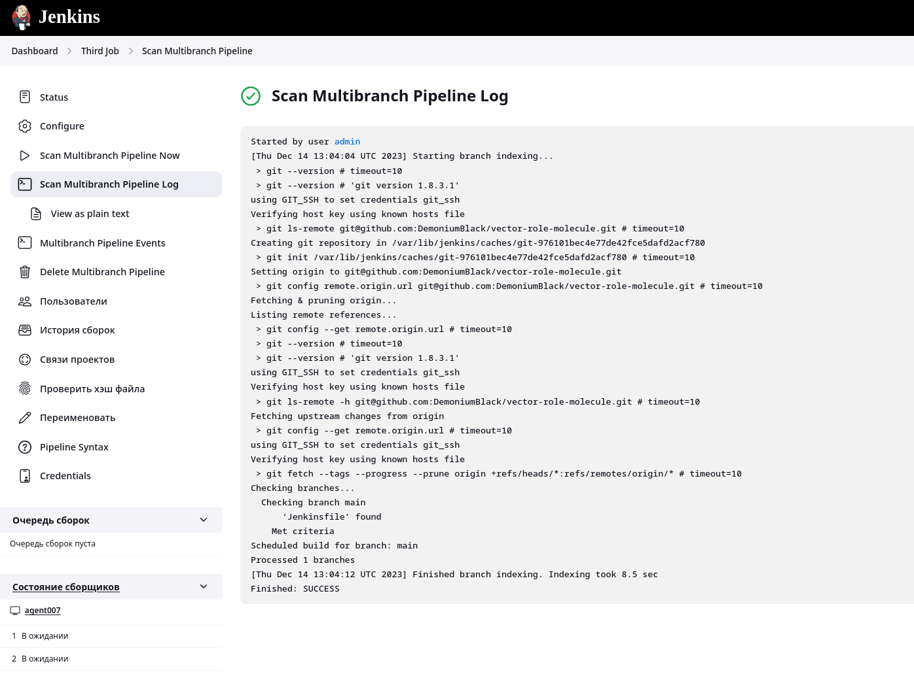

После запуска сборка Multibranch Pipeline выполняется успешно:

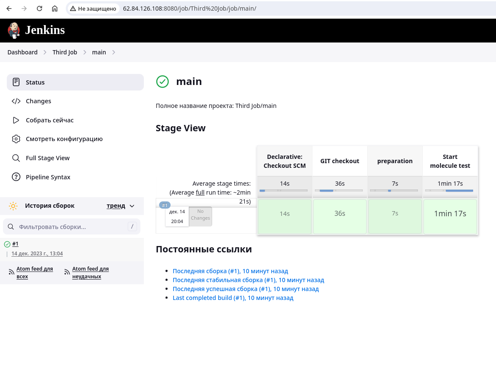

5. Создал Scripted Pipeline, наполнил его скриптом из [pipeline](https://github.com/netology-code/mnt-homeworks/blob/MNT-video/09-ci-04-jenkins/pipeline).

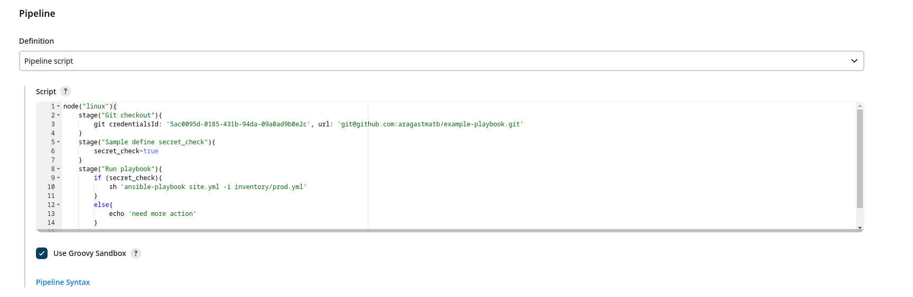

6. Внес необходимые изменения так, чтобы Pipeline запускал `ansible-playbook` без флагов `--check --diff`, если не установлен параметр при запуске джобы (prod_run = True).

Сборка без параметра prod_run = True запустилась без флага `--check --diff`:

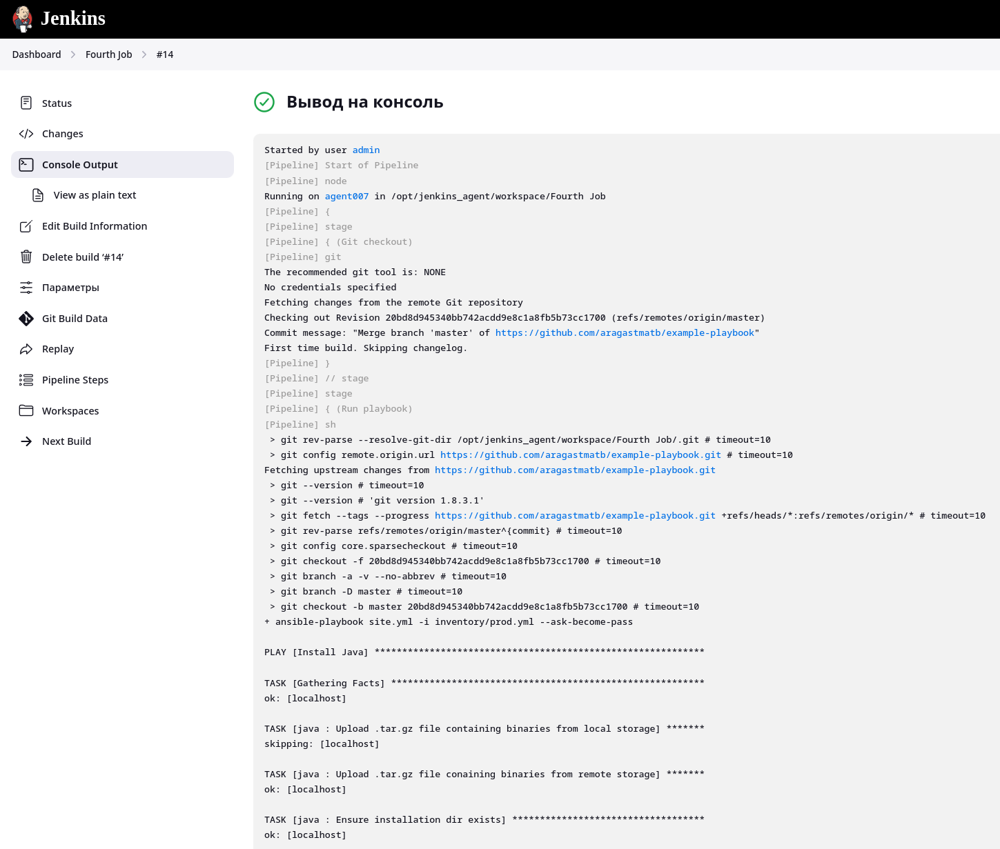

Сборка с параметром prod_run = True запустилась с флагом `--check --diff`:

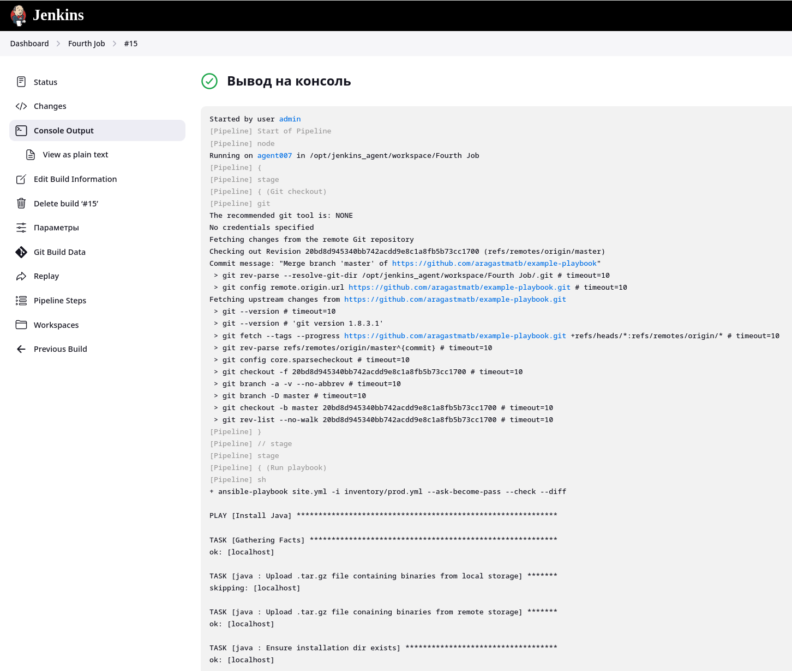

7. Изменения внесенные в Pipeline находятся в файле [`ScriptedJenkinsfile`](https://github.com/DemoniumBlack/fedorchukds-devops-33-24/blob/main/SRC/ScriptedJenkinsfile)

8. Репозиторий, на котором тестировался запуск Freestyle Job и Declarative Pipeline Job с запуском `molecule test`: https://github.com/DemoniumBlack/vector-role-molecule

Ссылка на Declarative Pipeline: https://github.com/DemoniumBlack/vector-role-molecule/blob/main/Jenkinsfile

Ссылка на Scripted Pipeline: https://github.com/DemoniumBlack/fedorchukds-devops-33-24/blob/main/SRC/ScriptedJenkinsfile


## Необязательная часть

1. Создать скрипт на groovy, который будет собирать все Job, завершившиеся хотя бы раз неуспешно. Добавить скрипт в репозиторий с решением и названием `AllJobFailure.groovy`.
2. Создать Scripted Pipeline так, чтобы он мог сначала запустить через Yandex Cloud CLI необходимое количество инстансов, прописать их в инвентори плейбука и после этого запускать плейбук. Мы должны при нажатии кнопки получить готовую к использованию систему.


## Необязательную часть решил пока что не делать.