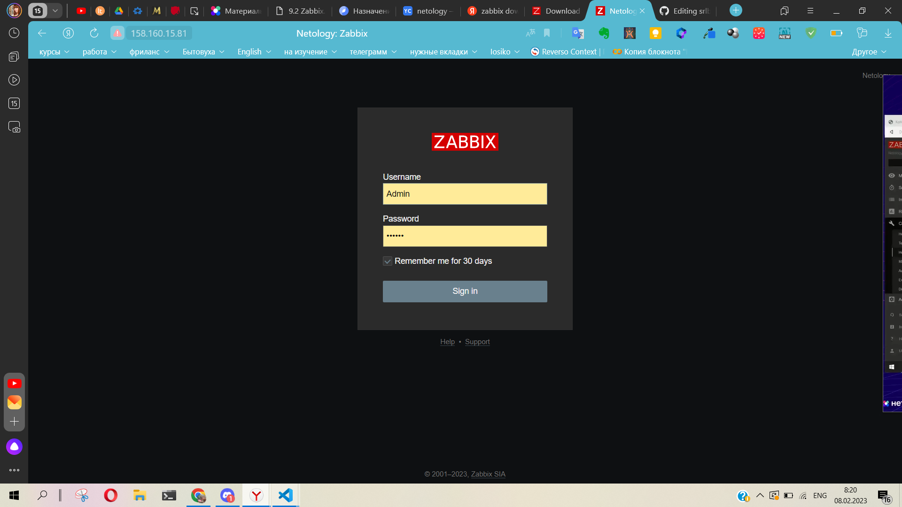
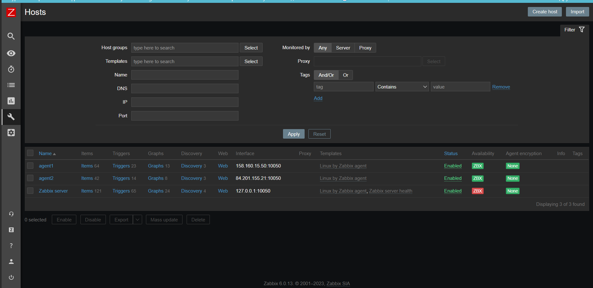
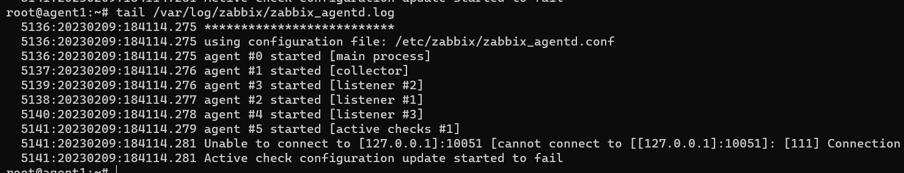
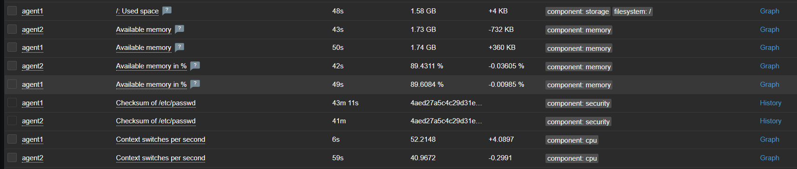
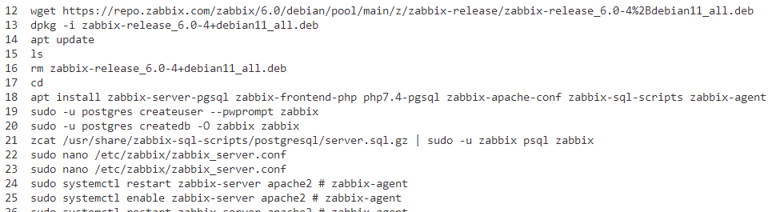

### Задание 1 

Установите Zabbix Server с веб-интерфейсом.

*Приложите скриншот авторизации в админке.*
*Приложите текст использованных команд в GitHub.*



```
   12  wget https://repo.zabbix.com/zabbix/6.0/debian/pool/main/z/zabbix-release/zabbix-release_6.0-4%2Bdebian11_all.deb
   13  dpkg -i zabbix-release_6.0-4+debian11_all.deb
   14  apt update 
   15  ls
   16  rm zabbix-release_6.0-4+debian11_all.deb 
   17  cd
   18  apt install zabbix-server-pgsql zabbix-frontend-php php7.4-pgsql zabbix-apache-conf zabbix-sql-scripts zabbix-agent
   19  sudo -u postgres createuser --pwprompt zabbix
   20  sudo -u postgres createdb -O zabbix zabbix
   21  zcat /usr/share/zabbix-sql-scripts/postgresql/server.sql.gz | sudo -u zabbix psql zabbix 
   22  sudo nano /etc/zabbix/zabbix_server.conf
   23  sudo nano /etc/zabbix/zabbix_server.conf
   24  sudo systemctl restart zabbix-server apache2 # zabbix-agent
   25  sudo systemctl enable zabbix-server apache2 # zabbix-agent
```
---

### Задание 2 

Установите Zabbix Agent на два хоста.

*Приложите скриншот раздела Configuration > Hosts, где видно, что агенты подключены к серверу.*



*Приложите скриншот лога zabbix agent, где видно, что он работает с сервером.*



*Приложите скриншот раздела Monitoring > Latest data для обоих хостов, где видны поступающие от агентов данные.*



*Приложите текст использованных команд в GitHub.*



---
## Задание со звёздочкой*

Это дополнительное задание. Его выполнять не обязательно. На зачёт это не повлияет. Вы можете его выполнить, если хотите глубже разобраться в материале.

### Задание 3* 

Установите Zabbix Agent на Windows (компьютер) и подключите его к серверу Zabbix.

*Приложите скриншот раздела Latest Data, где видно свободное место на диске C:*

