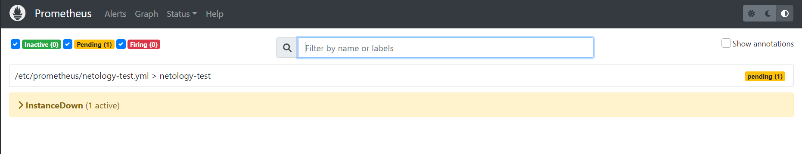
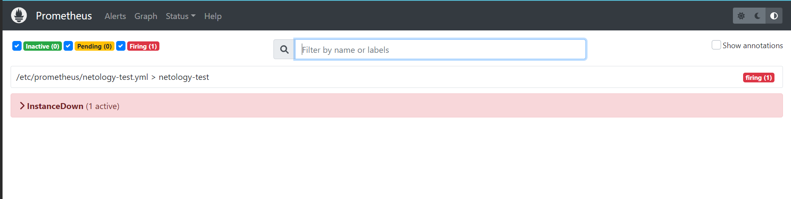
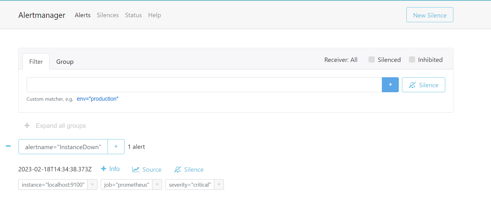
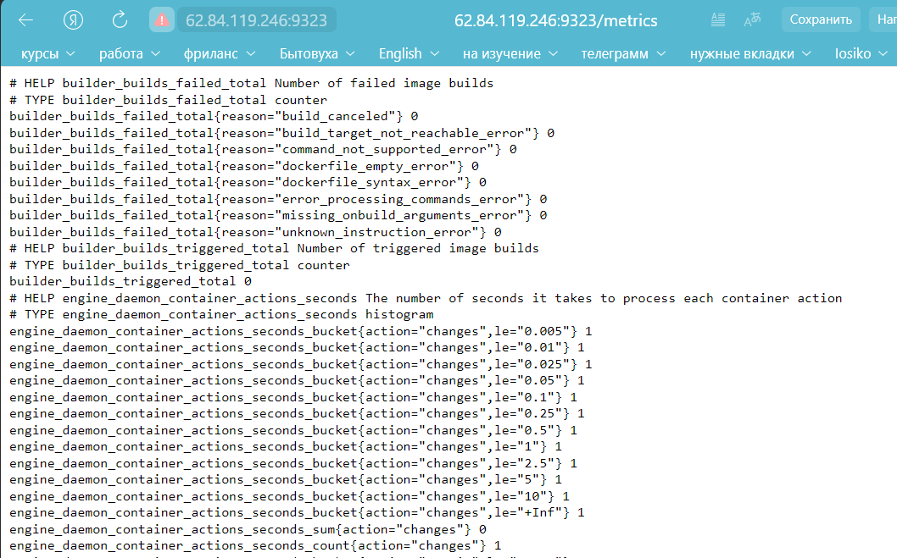
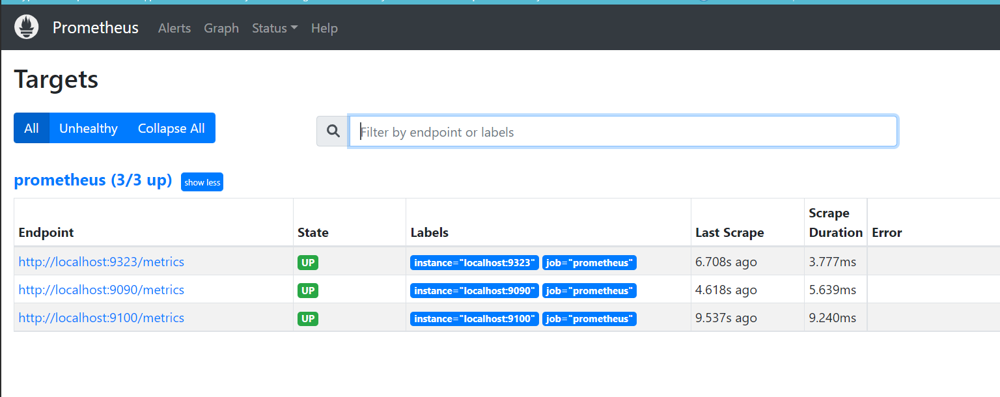

# Домашнее задание к занятию 9.5 «Prometheus. Ч. 2»

### Задание 1

Создайте файл с правилом оповещения, как в лекции, и добавьте его в конфиг Prometheus.

*Погасите node exporter, стоящий на мониторинге, и прикрепите скриншот раздела оповещений Prometheus, где оповещение будет в статусе Pending.*

---

### Задание 2

Установите Alertmanager и интегрируйте его с Prometheus.

*Прикрепите скриншот Alerts из Prometheus, где правило оповещения будет в статусе Fireing, и скриншот из Alertmanager, где будет видно действующее правило оповещения.*

---
/usr/local/bin/alertmanager --config.file=/etc/prometheus/alertmanager.yml --storage.path=/var/lib/prometheus/alertmanager $ARGS

### Задание 3

Активируйте экспортёр метрик в Docker и подключите его к Prometheus.

*Приложите скриншот браузера с открытым эндпоинтом, а также скриншот списка таргетов из интерфейса Prometheus.*

---
## Дополнительные задания со звёздочкой*

Эти задания дополнительные. Их выполнять не обязательно. На зачёт это не повлияет. Вы можете их выполнить, если хотите глубже разобраться в материале.

---

### Задание 4*

Создайте свой дашборд Grafana с различными метриками Docker и сервера, на котором он стоит.

*Приложите скриншот, на котором будет дашборд Grafana с действующей метрикой.*

echo "deb [arch=amd64 signed-by=/etc/apt/keyrings/docker.gpg] https://download.docker.com/linux/debian bullseye stable" > /etc/apt/sources.list.d/docker.list