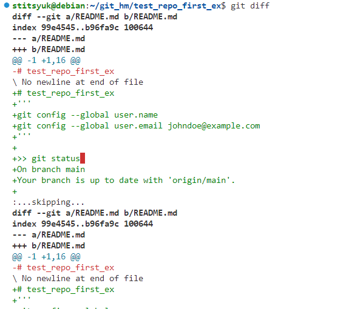
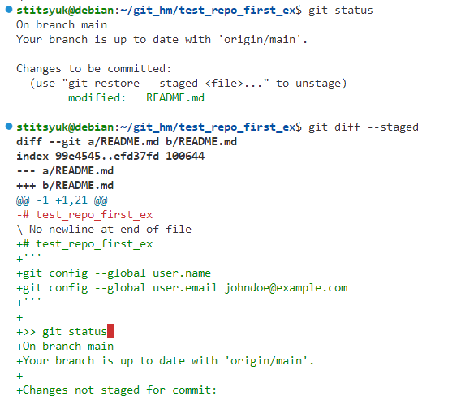
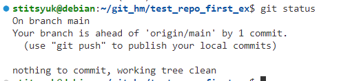
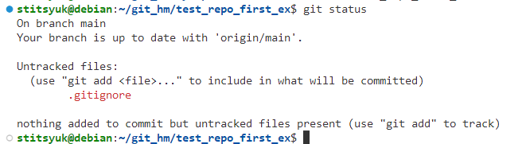
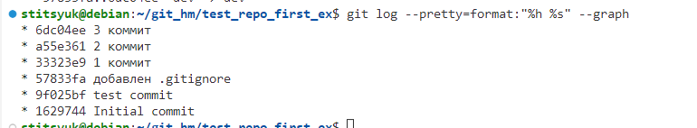

# Домашнее задание к занятию "`Название занятия`" - `Фамилия и имя студента`


### Инструкция по выполнению домашнего задания

   1. Сделайте `fork` данного репозитория к себе в Github и переименуйте его по названию или номеру занятия, например, https://github.com/имя-вашего-репозитория/git-hw или  https://github.com/имя-вашего-репозитория/7-1-ansible-hw).
   2. Выполните клонирование данного репозитория к себе на ПК с помощью команды `git clone`.
   3. Выполните домашнее задание и заполните у себя локально этот файл README.md:
      - впишите вверху название занятия и вашу фамилию и имя
      - в каждом задании добавьте решение в требуемом виде (текст/код/скриншоты/ссылка)
      - для корректного добавления скриншотов воспользуйтесь [инструкцией "Как вставить скриншот в шаблон с решением](https://github.com/netology-code/sys-pattern-homework/blob/main/screen-instruction.md)
      - при оформлении используйте возможности языка разметки md (коротко об этом можно посмотреть в [инструкции  по MarkDown](https://github.com/netology-code/sys-pattern-homework/blob/main/md-instruction.md))
   4. После завершения работы над домашним заданием сделайте коммит (`git commit -m "comment"`) и отправьте его на Github (`git push origin`);
   5. Для проверки домашнего задания преподавателем в личном кабинете прикрепите и отправьте ссылку на решение в виде md-файла в вашем Github.
   6. Любые вопросы по выполнению заданий спрашивайте в чате учебной группы и/или в разделе “Вопросы по заданию” в личном кабинете.
   
Желаем успехов в выполнении домашнего задания!
   
### Дополнительные материалы, которые могут быть полезны для выполнения задания

1. [Руководство по оформлению Markdown файлов](https://gist.github.com/Jekins/2bf2d0638163f1294637#Code)

---

### Задание 1

`Приведите ответ в свободной форме........`

1. `git status`

2. `git diff`

3. `git diff --staged`

4. `git commit`

5. https://github.com/stitsyuk98/test_repo_first_ex/commit/9f025bfb61f995324f60589f3dfaf559dfbe6bb4


---

### Задание 2

`Приведите ответ в свободной форме........`

1. Создайте файл .gitignore (обратите внимание на точку в начале файла) и проверьте его статус сразу после создания.


2. Добавьте файл .gitignore в следующий коммит git add....
3. Напишите правила в этом файле, чтобы игнорировать любые файлы .pyc, а также все файлы в директории cache.

```
*.рус
cache/*
```

4. Сделайте коммит и пуш.
https://github.com/stitsyuk98/test_repo_first_ex/commit/57833fa6c626ce13570d8e9ed607078ad3514001
 

---

### Задание 3

`Приведите ответ в свободной форме........`

1. Создайте новую ветку dev и переключитесь на неё.
2. Создайте файл test.sh с произвольным содержимым.
3. Сделайте несколько коммитов и пушей, имитируя активную работу над этим файлом.
4. Сделайте мердж этой ветки в основную. Сначала нужно переключиться на неё, а потом вызывать git merge.
5. Сделайте коммит и пуш.

`git log --pretty=format:"%h %s" --graph`


---
